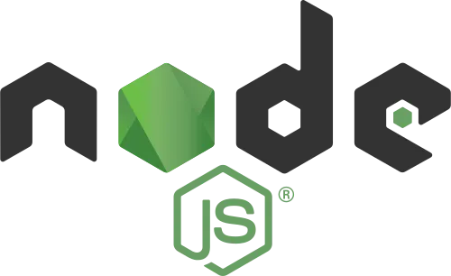
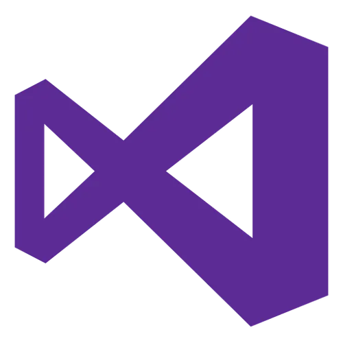
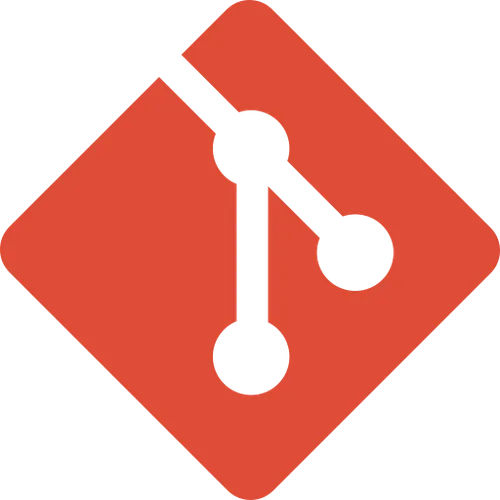

# Bonjour !

---

NotFound, développeur web front end en apprentissage, c'est une passion depuis toujours.

_Je ne suis pas encore développeur confirmer, mon principal objectif est de pouvoir devenir développeur à plein temps dans le futur_

---

# Compétences

<h2 align=center>Langages</h2>

<code></code>&nbsp; | &nbsp;
<code></code>&nbsp; | &nbsp;
<code></code>&nbsp; 

---

<h2 align=center>Framework</h2>

<code></code>&nbsp; | &nbsp;
<code></code>

---

<h2 align=center>Outils</h2>

<code></code> &nbsp; | &nbsp; 
<code></code> &nbsp; | &nbsp; 
<code></code> &nbsp; | &nbsp;
<code></code>&nbsp; | &nbsp;
<code></code>

---

<h2 align=center>En cours d'apprentissage</h2>

<code></code>&nbsp; | &nbsp;
<code></code>&nbsp; | &nbsp;
<code></code>&nbsp; | &nbsp;
<code></code>&nbsp; | &nbsp;
<code></code>&nbsp; | &nbsp;
<code></code>&nbsp;
</code> 

---

    

        Nombre de vues :  
        
    

---

