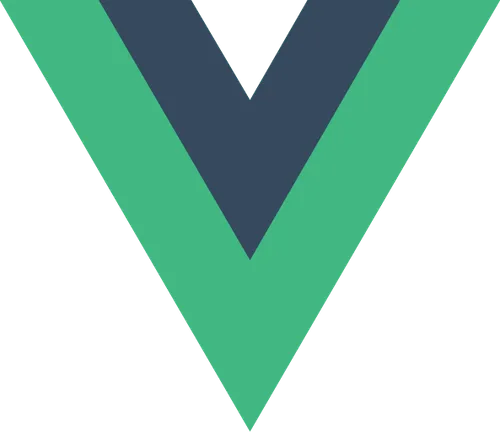
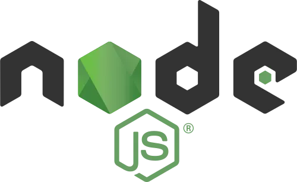
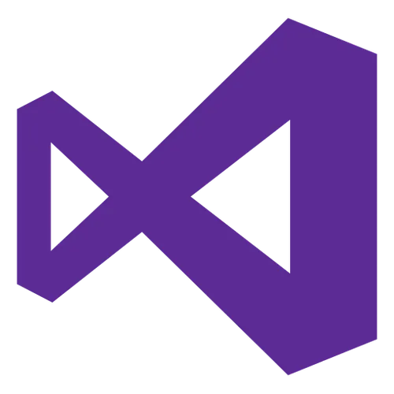
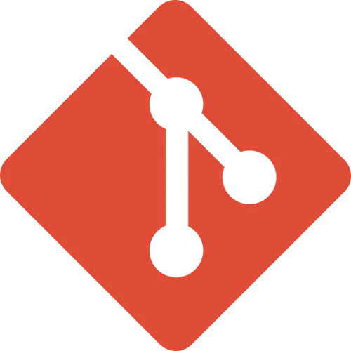
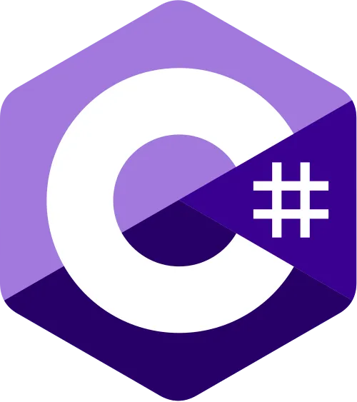

<<<<<<< HEAD
# Hello!

---

NotFound, a front-end web developer in training, it's been a passion of mine forever.

_I'm not yet a confirmed developer, my main objective is to become a full-time developer in the future_

---

# Skills

<h2 align=center>Languages</h2>

<code></code>&nbsp; |
<code></code>&nbsp; |
<code></code>

---

<h2 align=center>Framework</h2>

<code></code>&nbsp; |
<code></code>&nbsp;

---

<h2 align=center>Tools</h2>

<code></code> &nbsp; |
<code></code> &nbsp; |
<code></code>

---

<h2 align=center>Currently Learning</h2>

<code></code>&nbsp; |
<code></code>
</code> 

---
=======

  
  
  <h1>Hi 👋, I'm <b>NotFound</b></h1>
  <h3>🇫🇷 Frontend Developer | Passionate about Web & UI/UX</h3>
  
  

    
    
    
  

---

## 👨‍💻 About Me

- 🌱 Currently learning **React** & deepening my **JavaScript** skills
- Always eager to learn new technologies
- 💡 Quick learner with a growth mindset
- 🧩 Love building beautiful and functional UIs
- 📫 How to reach me: see below!

---

## 🛠️ Tech Stack

### Frontend

### Backend

### Database

### Tools & Platform

---

## 📊 GitHub Stats
>>>>>>> fb1eea166bbd4c6c3e2be6bc7d4e4510e912822f

<h2 align=center>Projects</h2>

<a href="https://www.curseforge.com/minecraft/mc-mods/discordbridge">DiscordBridge</a>

---

<<<<<<< HEAD
    

        View Count :  
        
    

=======
  
   
  
   
  

---

## 🏆 GitHub Trophies

  

---

## � Contact

  
  

---

📝 <b>Note</b>

Banner GIF sourced from <a href="https://tenor.com/bQh2q.gif">Tenor</a>

  Made with ❤️ by NotFound
>>>>>>> fb1eea166bbd4c6c3e2be6bc7d4e4510e912822f

